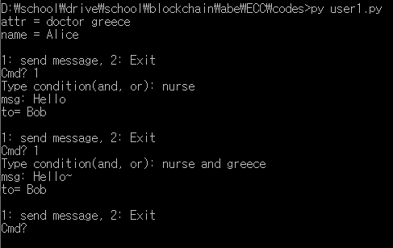

# CP-ABE-based-on-ECC-implementation
CP-ABE-based-on-ECC-implementation

## Introduction
This project is about the CP-ABE based on ECC implementation. The algorithm is based on <<A Novel Efficient Pairing-Free CP-ABE Based on Elliptic Curve Cryptography for IoT>> by SHENG DING, CHEN LI, AND HUI LI.

## Result
Scenario: Alice sends a message to Bob with boolean formula.  
### Alice

  
### Bob

  
## Notice
Please note that this implementation is unstable.
It is for education.
